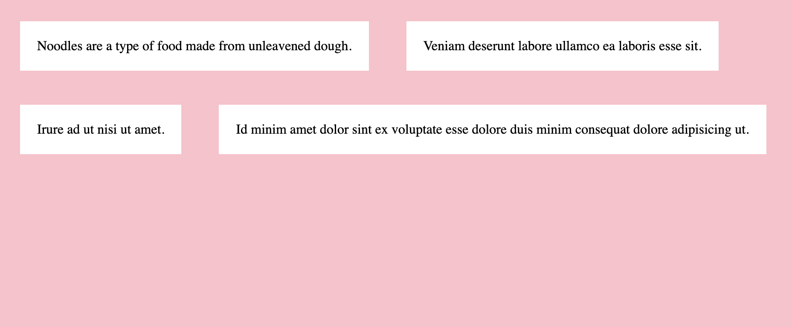

# CSS.2.5: Display Inline Block

`inline-block` `display` style is used when we want to have box (block) like boxes next to each other in a layout.

There are older ways of doing this, involving `float`, and newer ways involving flexbox and CSS grid, but inline-block is one of the basic ways to get box-like elements to sit next to each other.

```markup
<div class="article">
  Noodles are a type of food made from unleavened dough.
</div>
<div class="article">
  Veniam deserunt labore ullamco ea laboris esse sit.
</div>
<div class="article">
  Irure ad ut nisi ut amet.
</div>
<div class="article">
  Id minim amet dolor sint ex voluptate esse dolore duis minim consequat dolore adipisicing ut.
</div>
```

```css
body {
  background-color: pink;
}

.article {
  display: inline-block;
  background-color: white;
  padding: 20px;
  margin: 20px;
}
```



#### Properties of `inline-block`

* unlike `inline`, vertical margins and padding can be set on inline-block elements
* unlike `inline`, elements do not break within themselves to a new line.
* unlike `block`, the element does not take up 100% width by default.

## CSS Layout Gotchas

### White Spacing Between Elements

When using `inline-block`, whitespace in the HTML can affect the spacing of elements.



## Further Reading

Video on block, inline-block (also includes position fixed and absolute): [https://www.youtube.com/watch?v=x\_i2gga-sYg](https://www.youtube.com/watch?v=x\_i2gga-sYg)
