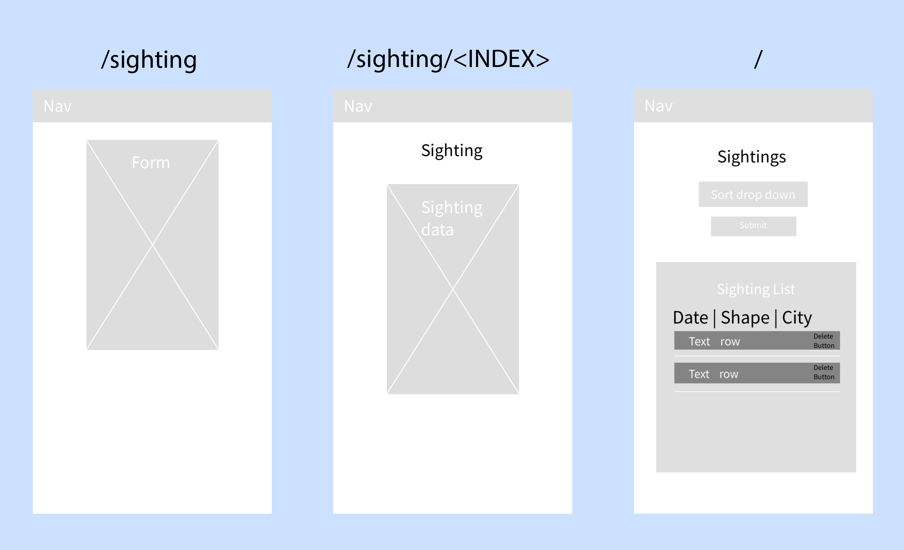

# 3.POCE.3: UFO Sightings

## Introduction

1. Create an app that tracks UFO sightings.
2. Begin by forking and cloning [RA's UFO Express repo](https://github.com/rocketacademy/ufo-express-bootcamp).

## Base

### Requirements

1. Create an app that renders pages for the routes below using the provided wireframes.
   1. We recommend working on the pages in the order the routes are listed.
   2. Work on the nav bar (listed in More Comfortable below) in the wireframes after finishing other Base requirements.
2. Render HTML using EJS templates server-side.
3. Store data in JSON files on the backend.
4. Style the app with Bootstrap or an equivalent CSS library.
5. Make pages responsive, i.e. usable and attractive in mobile and desktop layouts. Work on mobile layouts first to avoid clutter in mobile layouts.

### Routes

| URL Path                | Method | Purpose                                         |
| ----------------------- | ------ | ----------------------------------------------- |
| /sighting               | GET    | Render a form that will create a new sighting.  |
| /sighting               | POST   | Accept a POST request to create a new sighting. |
| /sighting/:index        | GET    | Render a single sighting.                       |
| /                       | GET    | Render a list of sightings.                     |
| /sighting/:index/edit   | GET    | Render a form to edit a sighting.               |
| /sighting/:index/edit   | PUT    | Accept a request to edit a single sighting      |
| /sighting/:index/delete | DELETE | Accept a request to delete a sighting.          |
| /shapes                 | GET    | Render a list of sighting shapes.               |
| /shapes/:shape          | GET    | Render a list of sightings that has one shape.  |


**No GET Route for Delete Form**

We will not implement a GET route to render a delete form because the delete form is integrated into the root (`/`) route. In the list of sightings, we will include a form with a single button on each row to delete that sighting.


### Wireframes

Use the following wireframes as starting points for page layouts. Feel free to get creative!

## Comfortable

### Sighting Report Create Time

1. Use the [JavaScript Date object](https://developer.mozilla.org/en-US/docs/Web/JavaScript/Reference/Global\_Objects/Date) to record when users create each new sighting report in a standardised format.
2. Render this create time in the sighting view.
3. Note that sighting report create time is distinct from the alleged sighting time.

### Sighting Data Validation

1. When creating and editing sightings, run server-side logic that validates user input and rejects invalid input.
2. Abstract data validation functions so they can be reused for both creating and editing sightings.


**Only Server-Side Validation Possible For Now**

We have yet to learn how to run arbitrary logic on form input fields, meaning any data validation needs to happen server-side. In Module 4 we will learn about client-side validation, where we can validate form values before they are sent to the server.


### Navigation Bar

1. Implement a navbar using Bootstrap or a similar CSS library to navigate between pages in our app.
2. Use EJS partials (see [3.2.3: EJS Partials](../../../Module2/day5/3.2-ejs/3.2.3-advanced-ejs.md)) to re-use navbar code from a single EJS template.

## More Comfortable

### EC2 Deployment

Deploy this UFO app on a new AWS EC2 instance.

### Data Validation UI

1. If input validation fails for any sighting input, use [Bootstrap form validation styles](https://getbootstrap.com/docs/4.5/components/forms/#validation) to let the user know what input was invalid.
2. Use a combination of server response data, EJS conditionals, and Bootstrap validation CSS classes to implement validation UI.

### JSON File Storage Delete

Abstract the DELETE HTTP method's logic into a `delete` function in our JSON file storage module. GET, POST, and PUT methods' logic should already be handled by `read`, `add`, and `edit` functions in `jsonFileStorage` respectively.

### Date Validation

Validate the user can't submit a sighting on a date in the future.

### Date Formatting

1. Install the [Moment](https://www.npmjs.com/package/moment) NPM package
2. Use Moment to format sighting creation date in "X days ago" format.
   1. [https://momentjs.com/docs/#/displaying/fromnow/](https://momentjs.com/docs/#/displaying/fromnow/)
3. Use Moment to format sighting date in "Monday, September 12th, 1997" format.

### Visit Counter

Add a visit counter to the home page that keeps count of all home page visits (including repeat visits) via cookies. See [3.5.1: Cookies](../../../Module2/day5/3.5-authentication/3.5.1-cookies.md) for a refresher.

### Daily Unique Visit Counter

Update the visit counter with the following.

1. The counter only increments for each user once a day.
2. The counter increments for visits to any page on the site.

### Favourites

1. Allow the user to select "favourite" sightings.
2. Store the list of favourite sightings for a given user in a cookie on the user's browser.
3. When that user visits the home page, render a list of links to that user's favourite sightings.

## Reference solution

Click [here](https://github.com/rocketacademy/ufo-express-bootcamp/tree/solution-base) to see the reference solution for this post class
