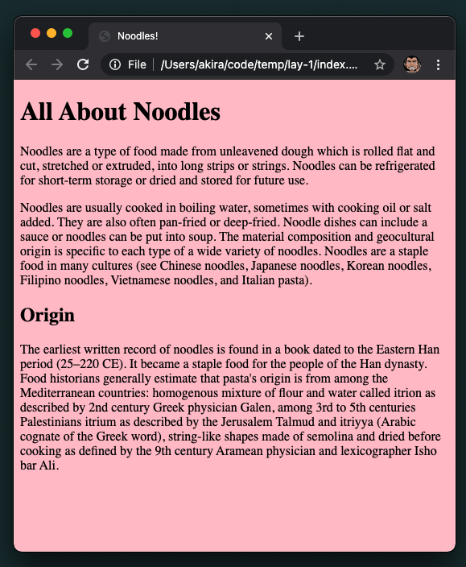

# 1.1.3.1: No Layout

If we want to put a basic vertical document on the page we can just put elements in the order we want, no layout design necessary.



```markup
<!doctype html>
<html lang="en">
  <head>
    <meta charset="utf-8">

    <link href="styles.css" rel="stylesheet">

    <title>Noodles!</title>
  </head>
  <body>

    <h1>All About Noodles</h1>

    <p>Noodles are a type of food made from unleavened dough which is rolled flat and cut, stretched or extruded, into long strips or strings. Noodles can be refrigerated for short-term storage or dried and stored for future use.</p>

    <p>Noodles are usually cooked in boiling water, sometimes with cooking oil or salt added. They are also often pan-fried or deep-fried. Noodle dishes can include a sauce or noodles can be put into soup. The material composition and geocultural origin is specific to each type of a wide variety of noodles. Noodles are a staple food in many cultures (see Chinese noodles, Japanese noodles, Korean noodles, Filipino noodles, Vietnamese noodles, and Italian pasta).</p>

    <h2>Origin</h2>

    <p>The earliest written record of noodles is found in a book dated to the Eastern Han period (25–220 CE). It became a staple food for the people of the Han dynasty. Food historians generally estimate that pasta's origin is from among the Mediterranean countries: homogenous mixture of flour and water called itrion as described by 2nd century Greek physician Galen, among 3rd to 5th centuries Palestinians itrium as described by the Jerusalem Talmud and itriyya (Arabic cognate of the Greek word), string-like shapes made of semolina and dried before cooking as defined by the 9th century Aramean physician and lexicographer Isho bar Ali.</p>

  </body>
</html>
```


