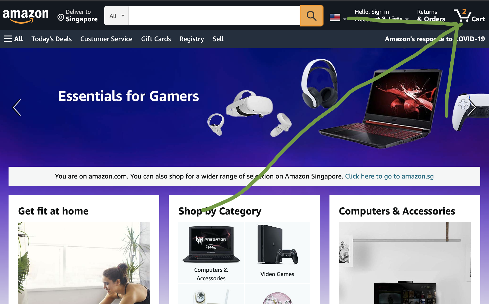

# 1.1.3.7: Position

When describing the functionality of elements with display we are discussing what happens when we fill elements with a certain amount of contents \(text, images, other boxes, etc.\), and then we let CSS lay out those boxes according to predetermined rules. The browser layout engine adjusts the size, shape and location of a set of elements and boxes based on:

1. The CSS box model
2. The display property
3. The contents of the box

There are a lot of overlapping rules to the behaviour of boxes using these attributes. Thus, there are some more **rare** cases when, instead of allowing CSS to lay out those boxes according to size and rules, we want to have a higher degree of control over where those boxes get placed.

This level of control is the `position` style. This style overrides any natural display layout behaviour in favor of more specific instructions of where to put a box.

### Setting Position

The position settings `top`, `right`, `bottom`, `left` set the _**offset from**_ the element's default position. Any unit can be used to set the position of the element: pixels, percent, em, vw, etc.

```css
p{
    position:fixed;
    top:300px;
}
```

### Position Relative

```css
p{
    position:relative;
    top:6px;
    left:6px;
}
```

_\(Relative position is rarely used on its own.\)_

Relative position means that the element takes up space but can be moved from where it was supposed to be.

### Position Absolute

```css
p{
    position:absolute;
    top:6px;
    left:6px;
}
```

_\(Absolute position is rarely used on its own.\)_

Absolute position means that the element is taken completely out of the normal box-model document flow.

### Position Relative / Absolute

```css
.card{
    position:relative;
}

.icon{
    position:absolute;
    top:6px;
    left:6px;
}
```

When an element is set to absolute that limits the scope of absolutely positioned child elements- That is, the child component's position will be absolute to the parent, not the entire screen.

Use cases:

* images that overlap contents in front or behind
* game-like elements that are inside something with pixel-fixed dimensions
* icons inside an element
* notification count numbers



### Position Fixed

```css
p{
    position:fixed;
}
```

Use cases:

* navigation bars
* chat windows


### z-index

When there is more than one element that has the position attribute it's possible that they will stack on top of eachother. The last element mentioned in the HTML will be on top. The style that controls the stacking order of the elements is z-index.

```css
<p id="announce">Ipsum</p>
<p>Lorem</p>
```

```css
p{
    position:absolute;
    top:6px;
    left:6px;
}
#announce{
    z-index:1;
}
```

## Further Reading

[https://css-tricks.com/absolute-relative-fixed-positioining-how-do-they-differ/](https://css-tricks.com/absolute-relative-fixed-positioining-how-do-they-differ/)

