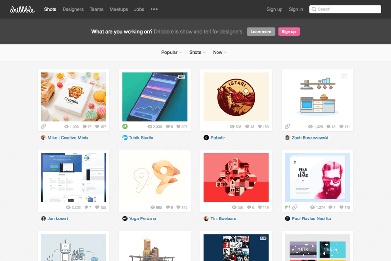
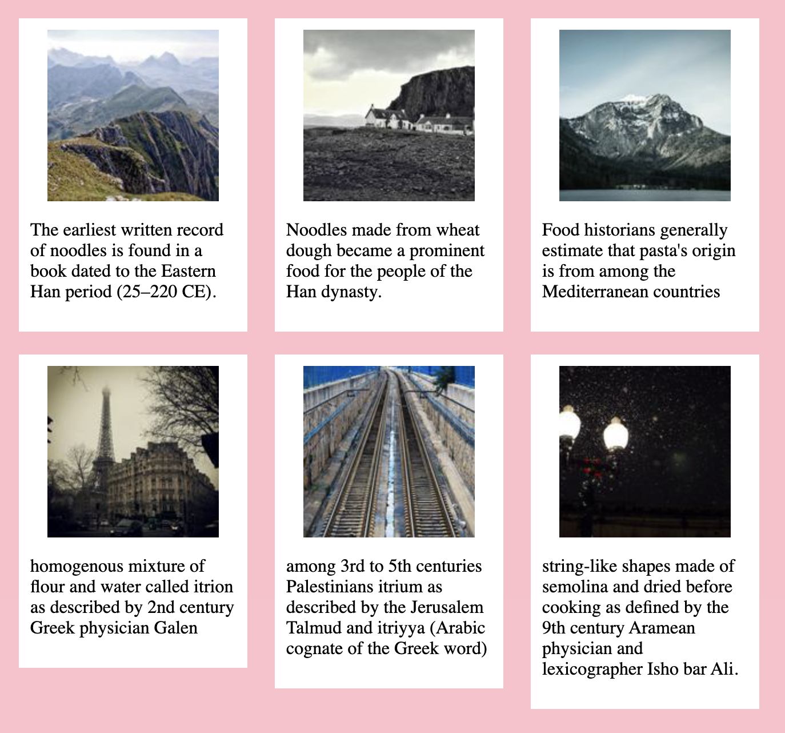

# CSS.2.6: Layout: Columns & Cards

## Cards



Card design is when a set of boxes is displayed next to each other in a layout. One of the simplest ways to create this layout is to specify some fixed pixel width elements on the screen and give them `display` `inline-block.`



```css
<!doctype html>
<html lang="en">
  <head>
    <meta charset="utf-8">

    <link href="styles6.css" rel="stylesheet">

    <title>Noodles!</title>
  </head>
  <body>
    <div class="card">
      
      <p>
      The earliest written record of noodles is found in a book dated to the Eastern Han period (25–220 CE).
      </p>
    </div>
    <div class="card">
      
      <p>
        Noodles made from wheat dough became a prominent food for the people of the Han dynasty.
      </p>
    </div>
    <div class="card">
      
      <p>
        Food historians generally estimate that pasta's origin is from among the Mediterranean countries
      </p>
    </div>
    <div class="card">
      
      <p>
        homogenous mixture of flour and water called itrion as described by 2nd century Greek physician Galen
      </p>
    </div>
    <div class="card">
      
      <p>
        among 3rd to 5th centuries Palestinians itrium as described by the Jerusalem Talmud and itriyya (Arabic cognate of the Greek word)
      </p>
    </div>
    <div class="card">
      
      <p>
        string-like shapes made of semolina and dried before cooking as defined by the 9th century Aramean physician and lexicographer Isho bar Ali.
      </p>
    </div>
  </body>
</html>

```

```css
*,
*:before,
*:after {
  box-sizing: border-box;
}

body {
  background-color: pink;
}

img {
  display: block;
  margin: 0 auto;
}

.card {
  display: inline-block;
  width: 200px;
  background-color: white;
  padding: 10px;
  margin: 10px;
  vertical-align: top;
}
```

## Columns

Now we'll use `inline-block` to create column layouts.


```markup
<!doctype html>
<html lang="en">
  <head>
    <meta charset="utf-8">

    <link href="styles6.css" rel="stylesheet">

    <title>Noodles!</title>
  </head>
  <body>
    <div class="column">
      Noodles are a type of food made from unleavened dough which is rolled flat and cut, stretched or extruded, into long strips or strings. Noodles can be refrigerated for short-term storage or dried and stored for future use. Noodles are usually cooked in boiling water, sometimes with cooking oil or salt added. They are also often pan-fried or deep-fried. Noodle dishes can include a sauce or noodles can be put into soup. The material composition and geocultural origin is specific to each type of a wide variety of noodles. Noodles are a staple food in many cultures (see Chinese noodles, Japanese noodles, Korean noodles, Filipino noodles, Vietnamese noodles, and Italian pasta).
    </div>
    <div class="column">
      The earliest written record of noodles is found in a book dated to the Eastern Han period (25–220 CE). Noodles made from wheat dough became a prominent food for the people of the Han dynasty. Food historians generally estimate that pasta's origin is from among the Mediterranean countries: homogenous mixture of flour and water called itrion as described by 2nd century Greek physician Galen, among 3rd to 5th centuries Palestinians itrium as described by the Jerusalem Talmud and itriyya (Arabic cognate of the Greek word), string-like shapes made of semolina and dried before cooking as defined by the 9th century Aramean physician and lexicographer Isho bar Ali.
    </div>
  </body>
</html>

```

```css
/* correct for sizing */
*,
*:before,
*:after {
  box-sizing: border-box;
}

body {
  background-color: pink;
  margin: 0; /* also to correct for sizing */
}

.column {
  display: inline-block;
  width: 48%;
  background-color: white;
  padding: 20px;
  margin: 20px;
  vertical-align: top; /* otherwise a shorter box will be stuck to the baseline of the taller box */
}
```

## Limitations

Note that for all of these layouts, the alignment and size of the boxes is not perfect. For example, the column layout doesn't have equal-height boxes. The columns are not set to a perfect amount of percent \(i.e., 50%\) The card layout may be awkward looking at certain screen widths. For right now don't worry too much about all the boxes aligning perfectly. Some of these behaviours we will get for free in the Bootstrap CSS library and with flexbox layout.
